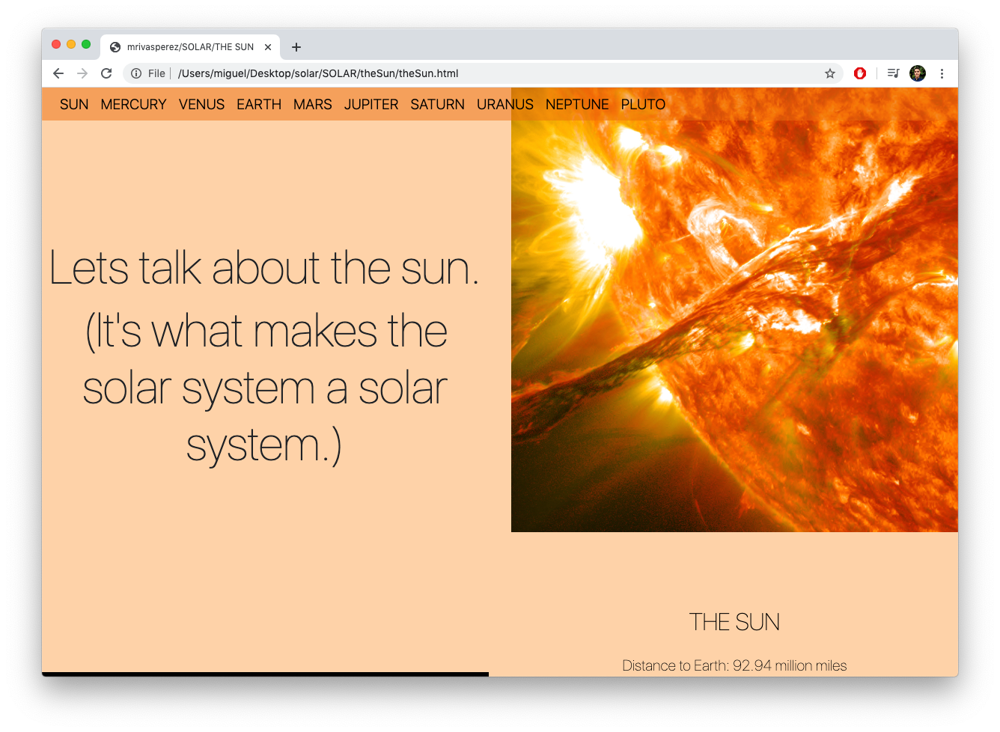

# SOLAR: A website to explore the solar system. 
by mrivasperez. live demo: <https://mrivasperez.github.io/SOLAR/>
## Screenshot

## Description
SOLAR is a modern, dynamic website about the Solar System. I created it when I was first exploring web development (hence the unuptimized, large images). It has a landing page that provides (index.html in root folder) brief information about the Solar System and greets the user with a page about the Sun when they click "ENTER" or "SOLAR." Once the user has entered the site they may learn more about other planets in the Solar System by clicking on their name in the navigation bar. I  developed this site using HTML, CSS (custom sheets, Flexbox, Bootstrap), and Vanilla JS (for navigation bar animations).

## Installation
To load this webpage locally, download the files as a zip file. Create a new folder in your system then drag and drop the contents of the zip file to that folder. Doouble click "index.html" to open the page.

## How to Use
When the user first begins to use the SOLAR page they will be greeted by the landing page. The landing page provides the user with information about the Solar System. To begin exploring the Solar System, the user must click "SOLAR" or "ENTER." Upon clicking either link, will be taken to the page about the Sun. The user can browse the site and learn about other planets by using the navigation menu.

## Credits
All information on SOLAR was found on wikipedia.
All images were on the public domain, provided by NASA or Unsplash.
